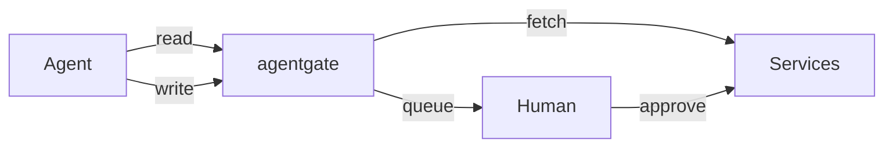

<p align="center">
  
</p>

<p align="center">
  API gateway for AI agents to access your personal data with human-in-the-loop write approval.
</p>

<p align="center">
  <a href="https://github.com/monteslu/agentgate/actions/workflows/ci.yml"></a>
  <a href="https://www.npmjs.com/package/agentgate"></a>
  <a href="https://www.npmjs.com/package/agentgate"></a>
</p>

<p align="center">
  <a href="https://agentgate.org/">AgentGate.org</a> ·
  <a href="#quick-start">Quick Start</a> ·
  <a href="docs/">Documentation</a>
</p>

**Reads** execute immediately. **Writes** queue for human approval.



## Quick Start

```bash
npx agentgate
```

Open http://localhost:3050, create a password, add services, create agent API keys.

## Supported Services

GitHub, Bluesky, Mastodon, Reddit, Google Calendar, YouTube, LinkedIn, Jira, Fitbit, Brave Search, Google Search

## Features

### Write Queue
All writes require human approval before execution. Agents submit requests with a comment explaining why, you approve or reject in the UI. [Details →](docs/write-queue.md)

### Skills
Generate a skill file for [OpenClaw](https://openclaw.ai) or [ClawdBot](https://clawdbot.com) with one curl. Drop it in your skills folder and your agent has secure access to all your services. [Details →](docs/skills.md)

### MCP Server
Works with Claude Code and other MCP clients. Your agent gets tools for services, queue, messaging, and mementos without seeing your credentials. [Details →](docs/mcp.md)

### Agent Messaging
Agents can message each other for multi-agent coordination. Run in supervised mode (you approve messages) or open mode (instant delivery). [Details →](docs/messaging.md)

### Mementos
Persistent memory storage with keyword tagging. Agents can save context and retrieve it later across sessions. [Details →](docs/memento.md)

### Access Control
Control which agents can access which services. Allowlist, denylist, or allow all. [Details →](docs/access-control.md)

### Webhooks
Get notified when requests are approved or completed. Works with OpenClaw's webhook system. [Details →](docs/webhooks.md)

## Security

- Writes require human approval (or explicit bypass for trusted agents)
- DMs blocked on social services
- Agents never see your actual credentials
- **Run on a separate machine from your agents** - if an agent has local filesystem access, it could read the database directly

## Self-Hosting

Works with systemd, Docker, PM2, or any Node.js host. Supports hsync and Cloudflare tunnels for remote access.

[Self-hosting guide →](docs/self-hosting.md)

## Agent Setup

Configure your agent with the base URL and API key. Agents can use REST or MCP.

[Agent setup guide →](docs/agent-setup.md)

## License

ISC
