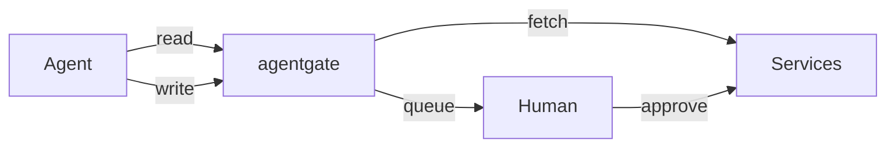

<p align="center">
  
</p>

<p align="center">
  API gateway for AI agents to access your personal data with human-in-the-loop write approval.
</p>

<p align="center">
  <a href="https://agentgate.org/">Website</a> ·
  <a href="#quick-start">Quick Start</a> ·
  <a href="docs/">Documentation</a>
</p>

**Reads** execute immediately. **Writes** queue for human approval.



## Quick Start

```bash
npm install && npm start
```

Open http://localhost:3050/ui, create a password, add services, create agent API keys. Done.

## Supported Services

GitHub, Bluesky, Mastodon, Reddit, Google Calendar, YouTube, LinkedIn, Jira, Fitbit, Brave Search, Google Search

## Features

| Feature | Description | Docs |
|---------|-------------|------|
| **Write Queue** | All writes require human approval | [details](docs/write-queue.md) |
| **MCP Server** | Works with Claude Code and other MCP clients | [details](docs/mcp.md) |
| **Agent Messaging** | Agents can message each other | [details](docs/messaging.md) |
| **Mementos** | Persistent memory with keyword tagging | [details](docs/memento.md) |
| **Access Control** | Per-service allowlist/denylist | [details](docs/access-control.md) |
| **Webhooks** | Notify agents when requests complete | [details](docs/webhooks.md) |

## Security

- Writes require human approval (or explicit bypass for trusted agents)
- DMs blocked on social services
- Agents never see your actual credentials
- **Run on a separate machine from your agents** - if an agent has local filesystem access, it could read the database directly

## Self-Hosting

Works with systemd, Docker, PM2, or any Node.js host. Supports hsync and Cloudflare tunnels for remote access.

[Self-hosting guide →](docs/self-hosting.md)

## Agent Setup

Configure your agent with the base URL and API key. Agents can use REST or MCP.

[Agent setup guide →](docs/agent-setup.md)

## License

ISC
