<p align="center">
  
</p>

<p align="center">
  API gateway for AI agents to access your personal data with human-in-the-loop write approval.
</p>

**Read requests** (GET) execute immediately. **Write requests** (POST/PUT/DELETE) are queued for human approval before execution.

## How It Works

```mermaid
flowchart LR
    A["🦀 Agent"] -->|read| G["🤖 agentgate"] -->|fetch| S[Services]
    A -->|write| G -->|queue| H["🧑 Human"] -->|approve| S
```



## Supported Services

- **GitHub** - Repos, issues, PRs, commits
- **Bluesky** - Timeline, posts, profile (DMs blocked)
- **Mastodon** - Timeline, notifications, profile (DMs blocked)
- **Reddit** - Subreddits, posts, comments (DMs blocked)
- **Google Calendar** - Events, calendars
- **YouTube** - Channels, videos, subscriptions
- **LinkedIn** - Profile (messaging blocked)
- **Jira** - Issues, projects, search
- **Fitbit** - Activity, sleep, heart rate, profile

## Security Notes

> **IMPORTANT: Do NOT run this service on the same machine as your AI agents (clawdbot, moltbot, openclaw, etc.).** If an agent has local access to the agentgate box, it could potentially read the database file directly, bypassing all security controls. Run this gateway on a separate, isolated machine that agents can only reach over the network.

- All write operations require human approval via the admin UI
- Agents cannot approve their own requests
- DMs/messaging endpoints are blocked for social services
- Admin UI is password-protected
- API keys are bcrypt-hashed and only shown once at creation

## Quick Start

```bash
# Install dependencies
npm install

# Start the server
npm start

# Or with auto-reload for development
npm run dev
```

The server runs on port 3050 by default. Set `PORT` environment variable to change it.

## First Time Setup

1. Open http://localhost:3050/ui
2. Create an admin password
3. Add service accounts (OAuth or API tokens depending on service)
4. Create API keys for your agents via CLI

## API Key Management

Manage API keys in the admin UI at `/ui/keys`, or via CLI:

```bash
# List all API keys
npm run keys list

# Create a new key
npm run keys create <name>

# Delete a key
npm run keys delete <id>
```

## Usage

Agents make requests with the API key in the Authorization header:

```bash
# Read requests (immediate)
curl -H "Authorization: Bearer rms_your_key_here" \
  http://localhost:3050/api/github/personal/repos/owner/repo

# Write requests (queued for approval)
curl -X POST http://localhost:3050/api/queue/github/personal/submit \
  -H "Authorization: Bearer rms_your_key_here" \
  -H "Content-Type: application/json" \
  -d '{"requests":[{"method":"POST","path":"/repos/owner/repo/issues","body":{"title":"Bug"}}],"comment":"Creating issue"}'
```

## API Documentation

Agents can fetch full API documentation at:
```
GET /api/readme
Authorization: Bearer rms_your_key_here
```

## Self-Hosting

### Running as a systemd Service (Linux)

Create `/etc/systemd/system/agentgate.service`:

```ini
[Unit]
Description=agentgate API gateway
After=network.target

[Service]
Type=simple
User=youruser
WorkingDirectory=/path/to/agentgate
ExecStart=/usr/bin/node src/index.js
Restart=on-failure
RestartSec=10
Environment=PORT=3050
Environment=NODE_ENV=production

[Install]
WantedBy=multi-user.target
```

Then:
```bash
sudo systemctl daemon-reload
sudo systemctl enable agentgate
sudo systemctl start agentgate
```

### Running with Docker

```dockerfile
FROM node:20-slim

WORKDIR /app
COPY package*.json ./
RUN npm ci --only=production
COPY . .

EXPOSE 3050
CMD ["node", "src/index.js"]
```

```bash
docker build -t agentgate .
docker run -d -p 3050:3050 -v ./data.db:/app/data.db agentgate
```

### Running with PM2

```bash
npm install -g pm2
pm2 start src/index.js --name agentgate
pm2 save
pm2 startup
```

### Remote Access with hsync

The admin UI supports [hsync](https://hsync.tech) for secure remote access without exposing ports. Configure it in the UI under Configuration > hsync.

### Remote Access with Cloudflare Tunnel

Use [trycloudflare](https://developers.cloudflare.com/cloudflare-one/connections/connect-apps/do-more-with-tunnels/trycloudflare/) for quick, free tunnels without a Cloudflare account:

```bash
# Install cloudflared
brew install cloudflared  # macOS
# or download from https://developers.cloudflare.com/cloudflare-one/connections/connect-apps/install-and-setup/installation/

# Start a tunnel (generates a random *.trycloudflare.com URL)
cloudflared tunnel --url http://localhost:3050
```

For persistent tunnels with a custom domain, create a [Cloudflare Tunnel](https://developers.cloudflare.com/cloudflare-one/connections/connect-apps/).

### Reverse Proxy (nginx)

```nginx
server {
    listen 443 ssl;
    server_name agentgate.yourdomain.com;

    ssl_certificate /path/to/cert.pem;
    ssl_certificate_key /path/to/key.pem;

    location / {
        proxy_pass http://127.0.0.1:3050;
        proxy_http_version 1.1;
        proxy_set_header Host $host;
        proxy_set_header X-Real-IP $remote_addr;
        proxy_set_header X-Forwarded-For $proxy_add_x_forwarded_for;
        proxy_set_header X-Forwarded-Proto $scheme;
    }
}
```

Set `BASE_URL` environment variable to your public URL for OAuth callbacks:
```bash
BASE_URL=https://agentgate.yourdomain.com npm start
```

## TODO

- [ ] Per-agent service access control - different agents can access different services/accounts

- [ ] Fine-grained endpoint control per service - whitelist/blacklist individual endpoints (even for read operations)

## License

ISC

