<p align="center">
  
</p>

<p align="center">
  API gateway for AI agents to access your personal data with human-in-the-loop write approval.
</p>

**Read requests** (GET) execute immediately. **Write requests** (POST/PUT/DELETE) are queued for human approval before execution.

📖 **[Read the blog post: How to Let AI Run Your Life Without Giving It Your Keys](https://monteslu.com/blog/ai-running-your-life)**

## How It Works

```mermaid
flowchart LR
    A["🦀 Agent"] -->|read| G["🤖 agentgate"] -->|fetch| S[Services]
    A -->|write| G -->|queue| H["🧑 Human"] -->|approve| S
```



## Supported Services

- **GitHub** - Repos, issues, PRs, commits
- **Bluesky** - Timeline, posts, profile (DMs blocked)
- **Mastodon** - Timeline, notifications, profile (DMs blocked)
- **Reddit** - Subreddits, posts, comments (DMs blocked)
- **Google Calendar** - Events, calendars
- **YouTube** - Channels, videos, subscriptions
- **LinkedIn** - Profile (messaging blocked)
- **Jira** - Issues, projects, search
- **Fitbit** - Activity, sleep, heart rate, profile

## Security Notes

> **IMPORTANT: Do NOT run this service on the same machine as your AI agents (clawdbot, moltbot, openclaw, etc.).** If an agent has local access to the agentgate box, it could potentially read the database file directly, bypassing all security controls. Run this gateway on a separate, isolated machine or container that agents can only reach over the network.

- All write operations require human approval via the admin UI
- Agents cannot approve their own requests
- DMs/messaging endpoints are blocked for social services
- Admin UI is password-protected
- API keys are bcrypt-hashed and only shown once at creation

## Quick Start

```bash
# Install dependencies
npm install

# Start the server
npm start

# Or with auto-reload for development
npm run dev
```

The server runs on port 3050 by default. Set `PORT` environment variable to change it.

## First Time Setup

1. Open http://localhost:3050/ui
2. Create an admin password
3. Add service accounts (OAuth or API tokens depending on service)
4. Create API keys for your agents via CLI

## Using with Clawdbot / OpenClaw

> ⚠️ **IMPORTANT:** Do NOT run agentgate on the same machine as your AI agent (Clawdbot, OpenClaw, etc.). If the agent has local filesystem access, it could read the database directly and bypass all security controls. Always run agentgate on a **separate, isolated machine** that agents can only reach over the network.

### Configure Your Agent

Add agentgate to your agent's `TOOLS.md`:

```markdown
### agentgate
- Base URL: `https://your-agentgate-server.com`
- Bearer token: `rms_your_key_here`
- **URL pattern:** `/api/{service}/{accountName}/...`
- **Reads (GET):** Execute immediately
- **Writes (POST/PUT/DELETE):** Queue for human approval

#### Write Queue
# Submit write request
POST /api/queue/{service}/{accountName}/submit
  body: { requests: [{method, path, body}], comment: "why" }

# Check status  
GET /api/queue/{service}/{accountName}/status/{id}
```

Or include in your agent's system prompt:

```
You have access to agentgate at https://your-server.com
API key: rms_your_key_here

For reads: GET /api/{service}/{account}/path
For writes: POST to /api/queue/{service}/{account}/submit with {requests, comment}

Always include a clear comment explaining your intent for write operations.
A human will review and approve before execution.
```

### Generate a Skill File

agentgate can generate an [AgentSkill](https://docs.openclaw.ai/tools/skills) compatible file:

```bash
curl -H "Authorization: Bearer rms_your_key" \
  https://your-server.com/api/skill > SKILL.md
```

### Webhook Notifications

agentgate can notify your agent when queue items are completed, failed, or rejected — closing the feedback loop so your agent knows immediately when requests are processed.

**Setup in Admin UI:**
1. Go to **Advanced → Clawdbot Notifications**
2. Enter your OpenClaw/Clawdbot webhook URL (e.g., `https://your-gateway.example.com/hooks/wake`)
3. Enter the hooks token from your OpenClaw config
4. Choose events: `completed`, `failed`, `rejected`

**Features:**
- **Real-time notifications** — Instant webhook on each approval/rejection
- **Notification status** — See ✓ notified / ⚠ failed on each queue entry
- **Retry individual** — Resend failed notifications one at a time
- **Batch catch-up** — "Retry All" sends missed notifications in one batched message

**Webhook payload:**
```json
{
  "text": "✅ [agentgate] Queue #abc123 completed\n→ github/monteslu\n→ https://github.com/...\nOriginal: \"Create PR for fix\"",
  "mode": "now"
}
```

Compatible with OpenClaw's `/hooks/wake` endpoint. See [OpenClaw webhook docs](https://docs.openclaw.ai/automation/webhook).

## Service Access Control

Control which agents can access specific services. Each service/account can be configured with one of three access modes:

- **All** (default) - All agents can access
- **Allowlist** - Only listed agents can access
- **Denylist** - All agents except listed ones can access

**Setup in Admin UI:**
1. Go to **Services** in the admin navigation
2. Click on a service to configure access
3. Set access mode and add/remove agents from the list

**API Endpoint:**
```bash
# Check your access to services
GET /api/services
Authorization: Bearer rms_your_key

# Response shows only services you can access
{ "services": [{ "service": "github", "account_name": "monteslu", "access_mode": "all" }, ...] }
```

When an agent lacks access to a service, API calls return `403 Forbidden` with a clear error message.

## Auth Bypass (Trusted Agents)

For highly trusted agents, you can bypass the write queue entirely. Agents with `bypass_auth` enabled execute write operations immediately without human approval.

> ⚠️ **Use with extreme caution.** Only enable for agents you completely trust with unsupervised write access.

**Setup in Admin UI:**
1. Go to **API Keys**
2. Click **Configure** next to the agent
3. Enable **Auth Bypass**

**Behavior:**
- All write operations (POST/PUT/DELETE) execute immediately
- No queue entries are created
- The agent is effectively operating unsupervised
- Reads work the same as before

This is useful for automation agents that need to perform routine operations without human bottlenecks.

## GitHub Webhooks

agentgate can receive GitHub webhook events and forward them to agent webhooks, enabling reactive workflows.

**Setup:**
1. In GitHub repo settings, add a webhook:
   - URL: `https://your-agentgate.com/webhooks/github`
   - Content type: `application/json`
   - Secret: (configure in agentgate settings)
   - Events: Choose which events to receive

2. Configure webhook forwarding in agentgate Admin UI under **Settings**

**Supported Events:**
- Push events
- Pull request events (opened, closed, merged, review requested)
- Issue events
- Workflow run events

Agents receive webhooks in the same format as other notifications, enabling them to react to repository changes in real-time.

## Agent Avatars

Agents can have custom avatars displayed in the admin UI for easy identification.

**Setup in Admin UI:**
1. Go to **API Keys**
2. Click the avatar placeholder next to an agent name
3. Upload an image (PNG, JPG, GIF, WebP supported)

Avatars are stored locally and displayed throughout the UI wherever the agent is referenced.

## Memento (Agent Memory)

Durable memory storage for agents. Store and retrieve memory snapshots tagged with keywords for long-term context preservation.

📖 **[See full documentation](docs/memento.md)** (coming soon)

**Key Features:**
- **Append-only** - Mementos are immutable once stored
- **Keyword tagging** - Each memento has 1-10 keywords (stemmed for matching)
- **Two-step retrieval** - Search returns metadata, fetch returns full content

**Quick API Overview:**
```bash
# Store a memento
POST /api/agents/memento
{ "content": "Your memory...", "keywords": ["project", "decision"] }

# Search by keyword
GET /api/agents/memento/search?keywords=project&limit=10

# Fetch full content
GET /api/agents/memento/42,38,15
```

Each agent sees only their own mementos. Maximum 12KB per memento.

## Inter-Agent Messaging

Agents can communicate with each other through agentgate, with optional human oversight.

📖 **[See full documentation](docs/inter-agent-messaging.md)**

**Quick overview:**
- Three modes: **Off**, **Supervised** (human approval), **Open** (immediate delivery)
- Configure agent webhooks in Admin UI under **API Keys > Configure**
- Endpoints: `/api/agents/messageable`, `/api/agents/message`, `/api/agents/messages`, `/api/agents/status`

### Broadcasts

Send messages to all agents at once:

```bash
POST /api/agents/broadcast
{ "message": "Team announcement: deployment starting" }

# Response
{ "delivered": ["Agent1", "Agent2"], "failed": [], "total": 2 }
```

Broadcasts are stored in the database and appear in each agent's message history. View broadcast history in the Admin UI under **Messages → Broadcast**.

## Agent Registry

Manage your agents in the admin UI at `/ui/keys`. Each agent has:

- **Name** - Unique identifier (case-insensitive)
- **API Key** - Bearer token for agent → agentgate authentication (shown once at creation)
- **Avatar** - Optional image for visual identification
- **Webhook URL** (optional) - Endpoint for agentgate → agent notifications
- **Webhook Token** (optional) - Bearer token for webhook authentication
- **Auth Bypass** (optional) - Skip write queue for trusted agents

When an agent's webhook is configured, agentgate will POST notifications for:
- Queue item status changes (approved/rejected/completed/failed)
- Inter-agent message delivery or rejection


## Usage

Agents make requests with the API key in the Authorization header:

```bash
# Read requests (immediate)
curl -H "Authorization: Bearer rms_your_key_here" \
  http://localhost:3050/api/github/personal/repos/owner/repo

# Write requests (queued for approval)
curl -X POST http://localhost:3050/api/queue/github/personal/submit \
  -H "Authorization: Bearer rms_your_key_here" \
  -H "Content-Type: application/json" \
  -d '{"requests":[{"method":"POST","path":"/repos/owner/repo/issues","body":{"title":"Bug"}}],"comment":"Creating issue"}'
```

## API Documentation

Agents can fetch full API documentation at:
```
GET /api/readme
Authorization: Bearer rms_your_key_here
```

## Self-Hosting

### Running as a systemd Service (Linux)

Create `/etc/systemd/system/agentgate.service`:

```ini
[Unit]
Description=agentgate API gateway
After=network.target

[Service]
Type=simple
User=youruser
WorkingDirectory=/path/to/agentgate
ExecStart=/usr/bin/node src/index.js
Restart=on-failure
RestartSec=10
Environment=PORT=3050
Environment=NODE_ENV=production

[Install]
WantedBy=multi-user.target
```

Then:
```bash
sudo systemctl daemon-reload
sudo systemctl enable agentgate
sudo systemctl start agentgate
```

### Running with Docker

```dockerfile
FROM node:20-slim

WORKDIR /app
COPY package*.json ./
RUN npm ci --only=production
COPY . .

EXPOSE 3050
CMD ["node", "src/index.js"]
```

```bash
docker build -t agentgate .
docker run -d -p 3050:3050 -v ./data.db:/app/data.db agentgate
```

### Running with PM2

```bash
npm install -g pm2
pm2 start src/index.js --name agentgate
pm2 save
pm2 startup
```

### Remote Access with hsync

The admin UI supports [hsync](https://hsync.tech) for secure remote access without exposing ports. Configure it in the UI under Configuration > hsync.

### Remote Access with Cloudflare Tunnel

Use [trycloudflare](https://developers.cloudflare.com/cloudflare-one/connections/connect-apps/do-more-with-tunnels/trycloudflare/) for quick, free tunnels without a Cloudflare account:

```bash
# Install cloudflared
brew install cloudflared  # macOS
# or download from https://developers.cloudflare.com/cloudflare-one/connections/connect-apps/install-and-setup/installation/

# Start a tunnel (generates a random *.trycloudflare.com URL)
cloudflared tunnel --url http://localhost:3050
```

For persistent tunnels with a custom domain, create a [Cloudflare Tunnel](https://developers.cloudflare.com/cloudflare-one/connections/connect-apps/).

### Reverse Proxy (nginx)

```nginx
server {
    listen 443 ssl;
    server_name agentgate.yourdomain.com;

    ssl_certificate /path/to/cert.pem;
    ssl_certificate_key /path/to/key.pem;

    location / {
        proxy_pass http://127.0.0.1:3050;
        proxy_http_version 1.1;
        proxy_set_header Host $host;
        proxy_set_header X-Real-IP $remote_addr;
        proxy_set_header X-Forwarded-For $proxy_add_x_forwarded_for;
        proxy_set_header X-Forwarded-Proto $scheme;
    }
}
```

Set `BASE_URL` environment variable to your public URL for OAuth callbacks:
```bash
BASE_URL=https://agentgate.yourdomain.com npm start
```

## TODO

- [ ] Fine-grained endpoint control per service - whitelist/blacklist individual endpoints (even for read operations)

## License

ISC
